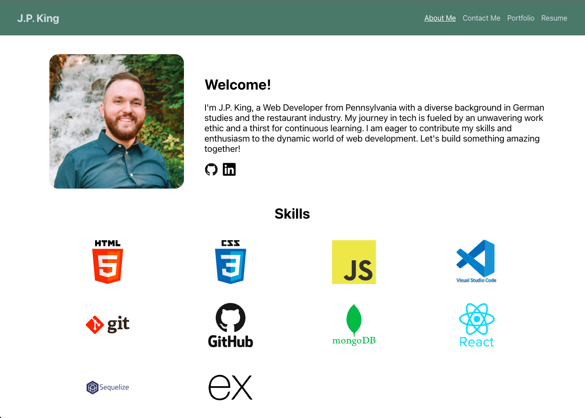

# react_portfolio

## Description
This is my portfolio, built with React.

[Deployed Link](https://jpking1337portfolio.netlify.app/)

## Table of Contents
- [Installation](#installation)
- [Usage](#usage)
- [Credits](#credits)
- [License](#license)

## Installation
You can clone this GitHub repo with the command line:
git clone git@github.com:jp-king-1337/react_portfolio.git

## Usage
This project is to be graded as part of my participation in the Rutgers Coding Bootcamp, but more importantly, it demonstrates the things I've learned in the bootcamp, and beyond!

Upon accessing the project at the [deployed link](https://jpking1337portfolio.netlify.app/), a user will be able to learn about me through the About Me section, or contact me through the form in - you guessed it - the Contact Me section. Creative names, right? Additionally, any visitor to the site can view a portfolio of my work, which will be updated periodically with additional examples, and download my resume if desired.

## Credits
ChatGPT has become my best friend when coding. I go to it for any errors I can't understand and for quick confirmation that a snippet of code will function how I want it to. This project is no different - I consulted ChatGPT for assistance handling errors and figuring out solutions to problems when browsing the internet myself proved either ineffective or too tedious. It's like a personal tutor available 24/7!

## License
This application is covered under the "MIT" license.
<!-- 

## Badges
N/A

## Features
N/A

## How to Contribute
N/A

## Tests
N/A -->